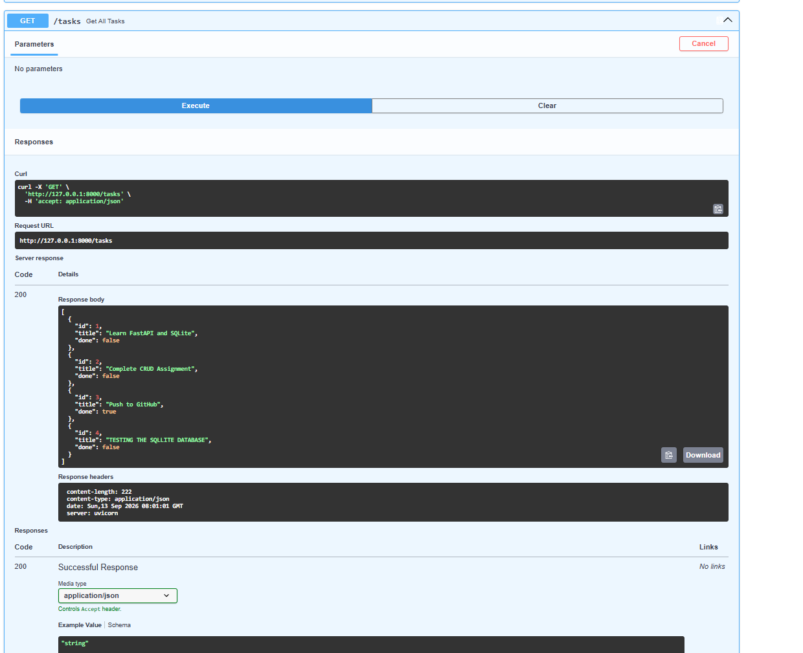

# Task API - SQLite CRUD

A simple CRUD API built using FastAPI and SQLite.

## Features

- Create tasks
- Read all tasks
- Read a task by ID
- Update tasks
- Delete tasks
- SQLite database storage
- Automatic database and table creation
- Seed data when the table is empty

## Technologies Used

- Python
- FastAPI
- SQLite
- Pydantic
- Uvicorn

## Why SQLite?

SQLite was chosen because it is lightweight, simple to set up, and does not require a separate database server. It is suitable for a small CRUD application like this one.

## Database

The SQLite database is stored in:

`tasks.db`

The application creates the database and `tasks` table automatically when it starts.

The table contains:

| Column | Type |
|---|---|
| id | INTEGER |
| title | TEXT |
| done | BOOLEAN |

The database is seeded with three tasks when the table is empty.

## How to Run

Install the required packages:

```bash
pip install fastapi uvicorn
```

## DB Browser Screenshot

