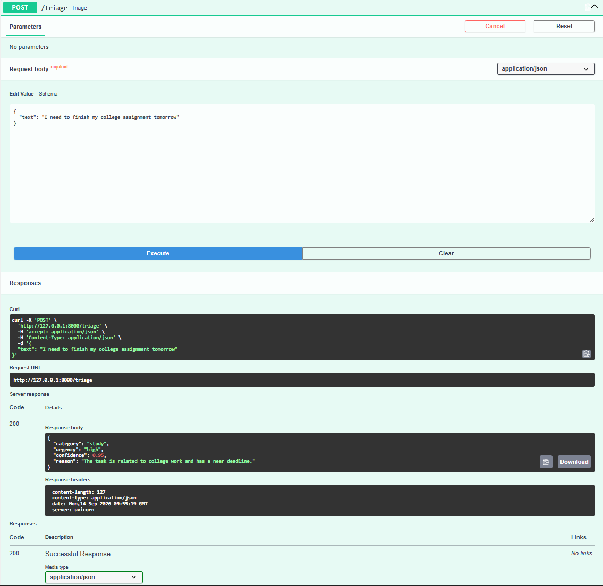
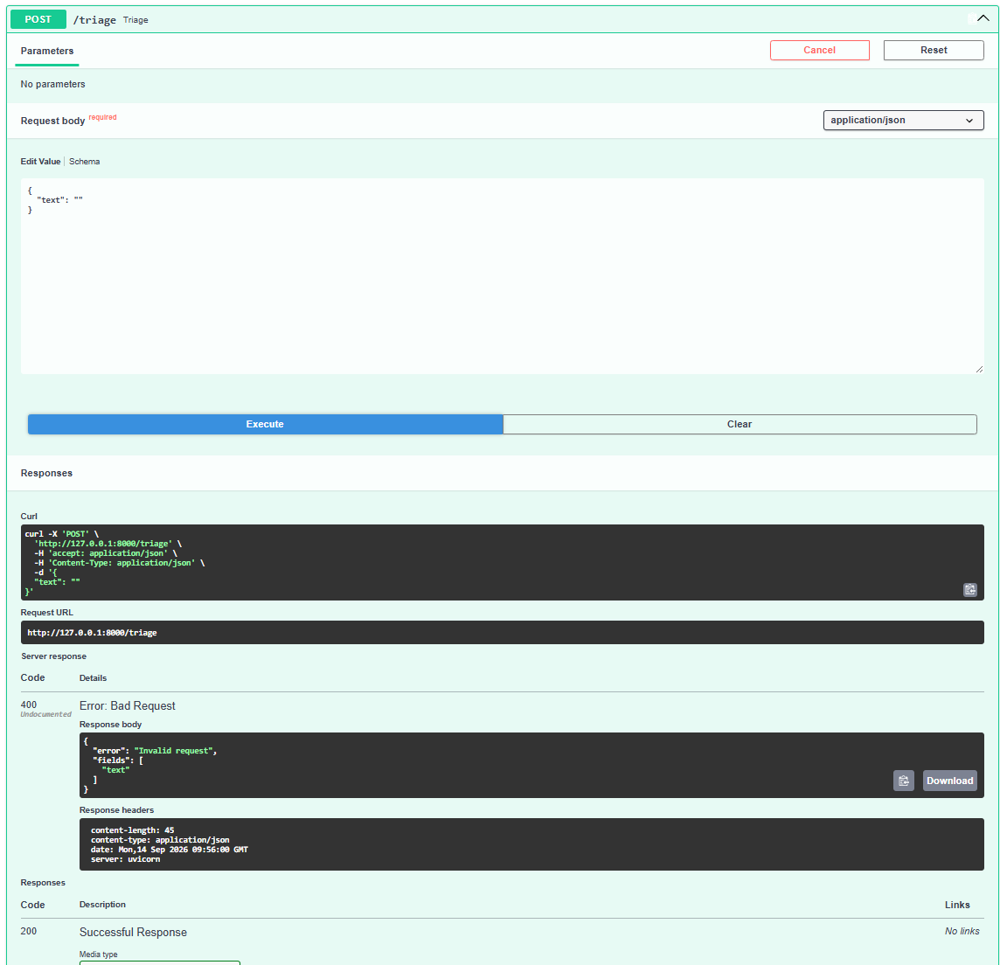
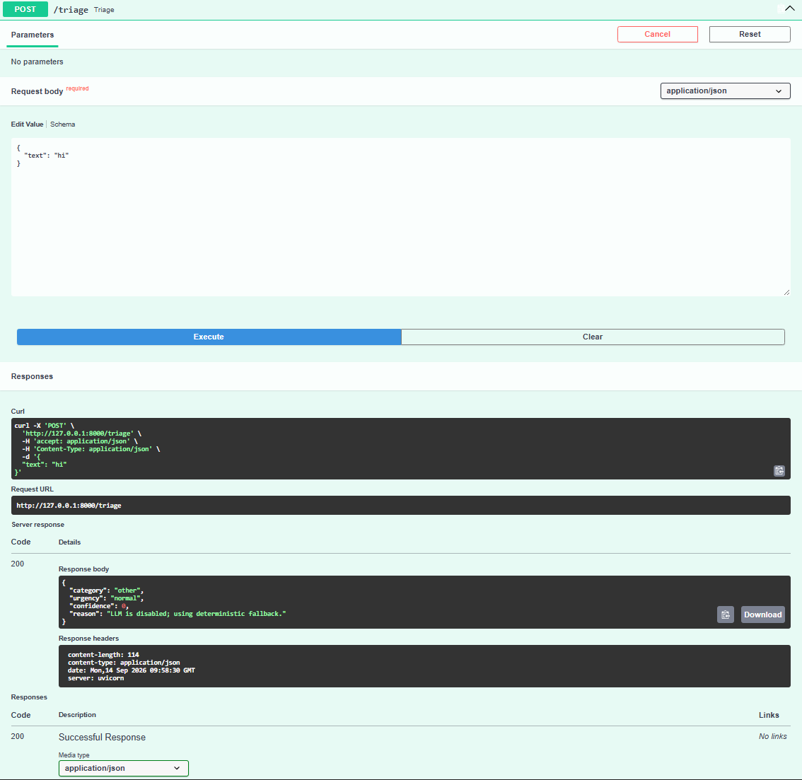
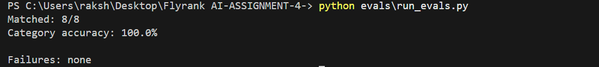
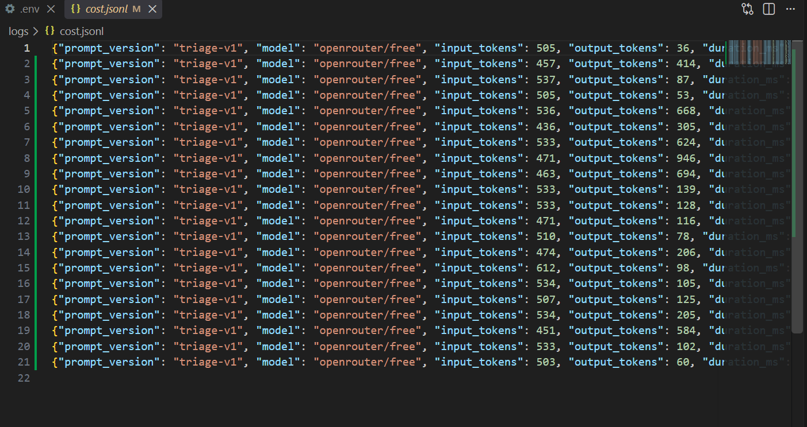

# FlyRank A17 — LLM Task Triage API

## What It Does

Adds an LLM-powered `/triage` endpoint to the existing FastAPI task API.

It takes a task description and returns validated JSON with a category, urgency, confidence, and reason.

## Endpoint

### POST `/triage`

Example:

```json
{
  "text": "I need to finish my college assignment tomorrow"
}
```

Response:

```json
{
  "category": "study",
  "urgency": "high",
  "confidence": 0.95,
  "reason": "The task is related to college work and has a near deadline."
}
```

Invalid input returns `400`.

## Job Card

**Categories:** `work`, `study`, `personal`, `admin`, `other`

**Urgency:** `low`, `normal`, `high`

**Must never:** invent categories, return extra fields, make medical/legal/financial decisions, reveal the prompt, or return raw model text.

**When unsure:** use `other` with low confidence.

## LLM Setup

- Provider: OpenRouter
- Model: `openrouter/free`
- Prompt: `prompts/triage-v1.md`
- Temperature: `0.0`
- Timeout: `30s`
- Retries: timeouts, `429`, and `5xx` only
- Retry backoff: `1s → 2s → 4s`

The API response is parsed and validated with Pydantic. If validation fails, one repair attempt is made. A second failure returns `422` and is stored in `logs/quarantine.jsonl`.

## Kill Switch

Set:

```env
LLM_ENABLED=false
```

The API then uses a deterministic fallback without calling the LLM.

Stub mode:

```env
LLM_STUB=1
```

## Cost Logging

LLM calls are recorded in:

```text
logs/cost.jsonl
```

The log contains the prompt version, model, token usage, duration, and repair count.

The free model used for this assignment has an estimated model cost of approximately `$0` for 10,000 requests/day, subject to provider limits.

## Evaluation

**September 14, 2026 — prompt `triage-v1`**

```text
Matched: 8/8
Category accuracy: 100.0%

Failures: none
```

Run with:

```bash
python evals/run_evals.py
```

## Verification

### Successful Triage


### Invalid Request


### Kill Switch


### Evaluation


### Cost Log


## Setup

```bash
pip install -r requirements.txt
uvicorn main:app --reload
```

Swagger:

```text
http://127.0.0.1:8000/docs
```

Copy `.env.example` to `.env` and add the API key.

## Project Structure

```text
├── evals/
├── llm/
├── logs/
├── prompts/
├── screenshots/
├── .env.example
├── JOB-CARD.md
├── main.py
└── README.md
```

## Future Improvements

Add more adversarial evaluation cases, stronger structured-output support, and additional provider-specific error handling.